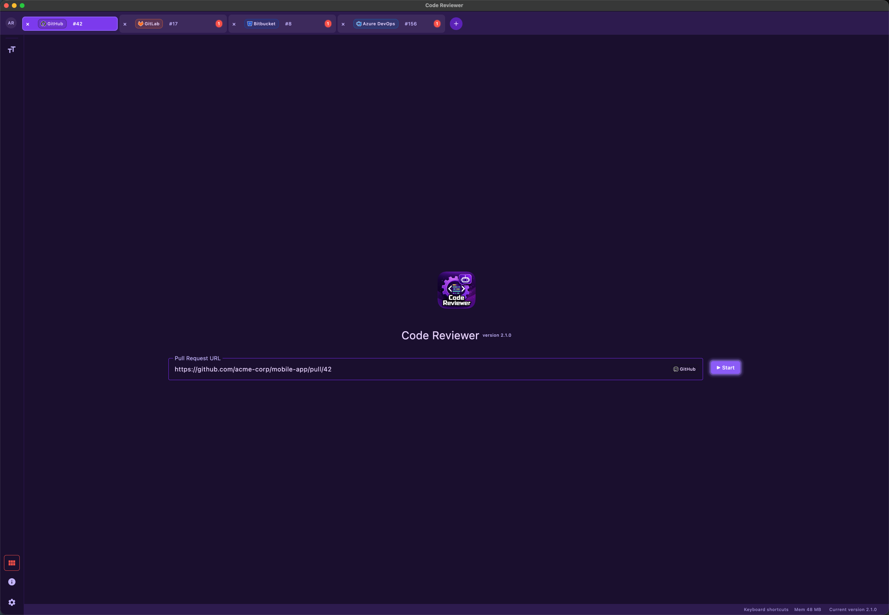
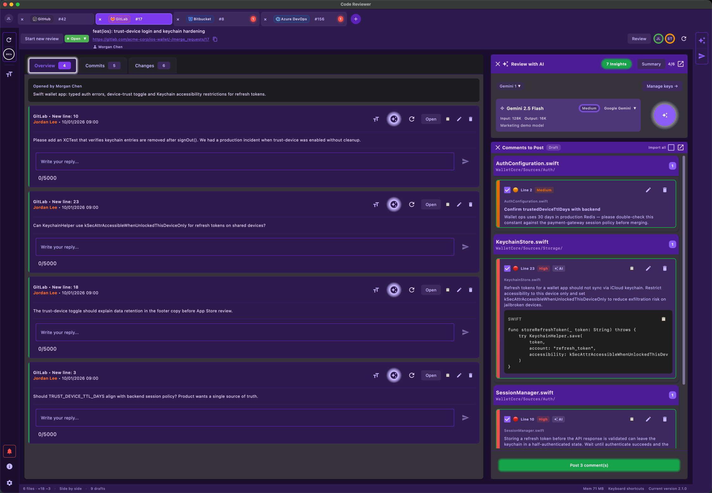
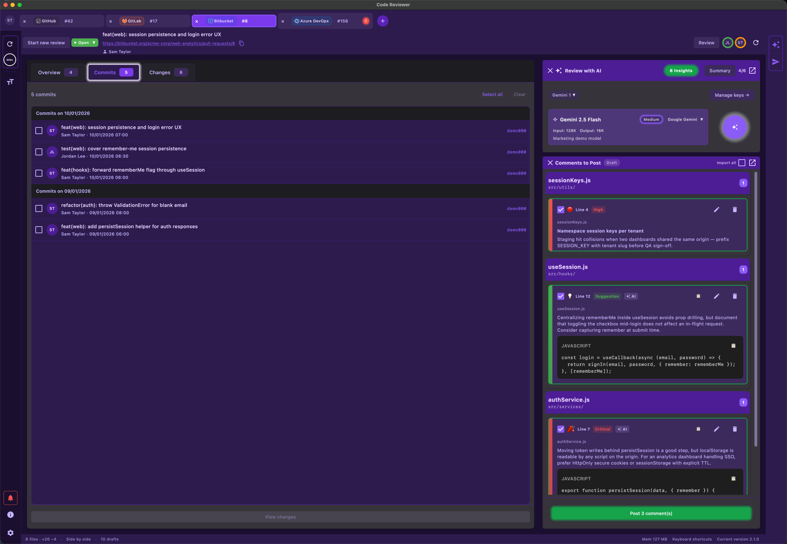
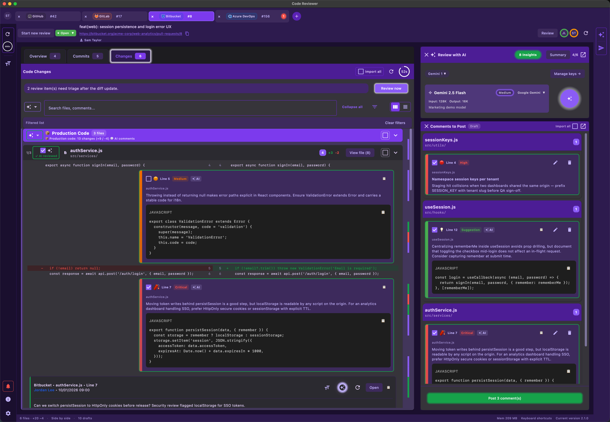
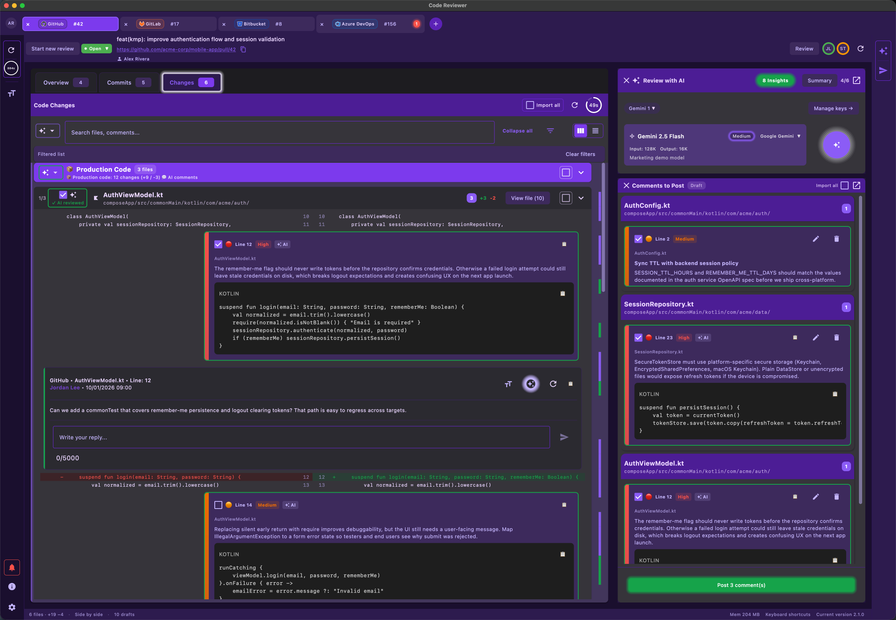
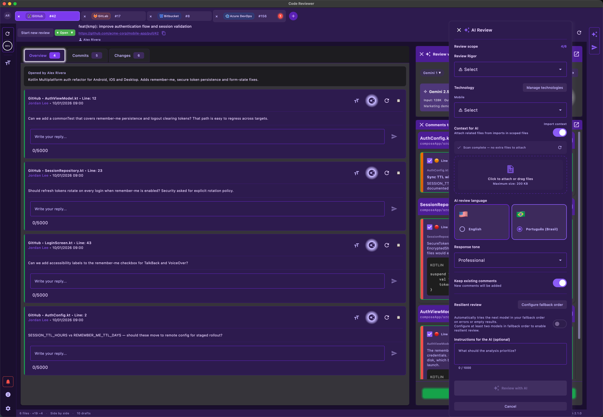
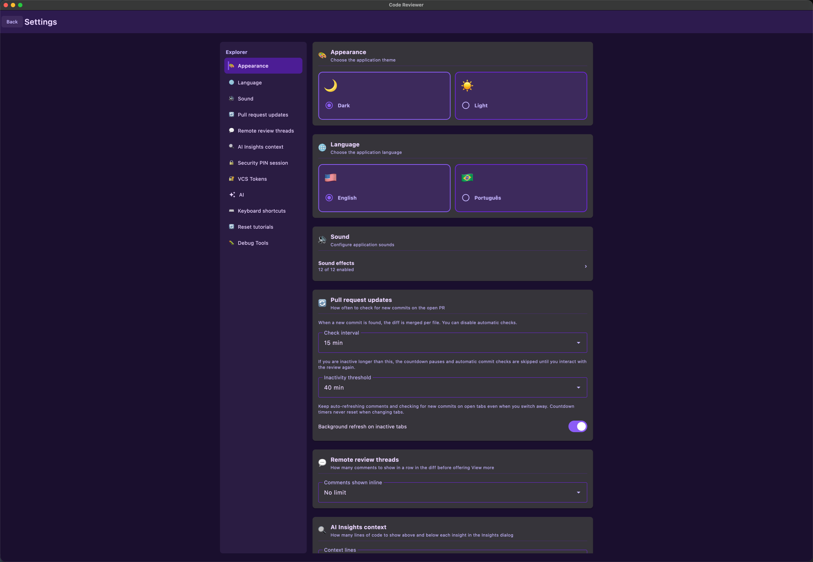
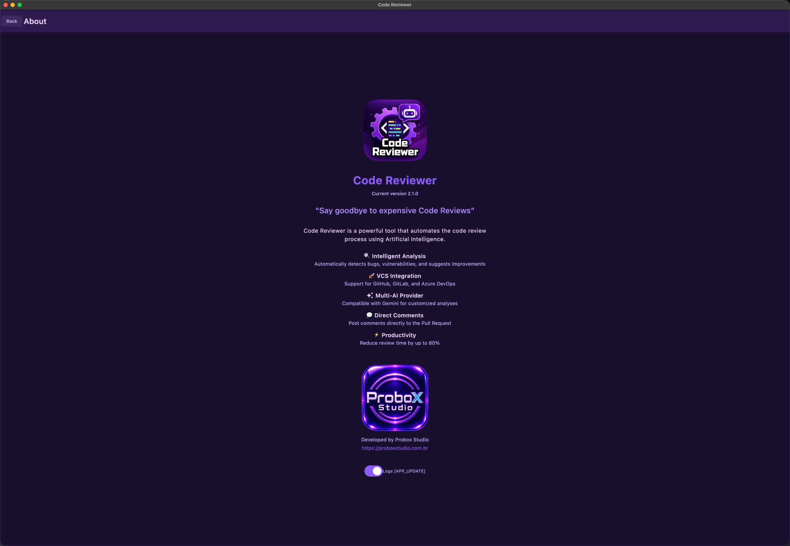

# Code Reviewer

> **Say goodbye to costly Code Review**

**Code Reviewer** is an AI-powered code review assistant for **macOS**, **Windows**, and **Linux**. Automate analyses, publish comments directly on Pull Requests, and reduce review time by up to 80%.

---

## Download

**Latest version: [2.1.0](https://github.com/studiopaulomoraes/Probox-CodeReviewer-releases/releases/tag/2.1.0)** · [All releases](https://github.com/studiopaulomoraes/Probox-CodeReviewer-releases/releases)

| Platform | Architecture | Format | Download |
|----------|--------------|--------|----------|
| **Windows** | x64 | ZIP | [**Download**](https://github.com/studiopaulomoraes/Probox-CodeReviewer-releases/releases/download/2.1.0/CodeReviewer-2.1.0-win.zip) |
| **macOS** | Apple Silicon (M1/M2/M3/M4) | ZIP | [**Download**](https://github.com/studiopaulomoraes/Probox-CodeReviewer-releases/releases/download/2.1.0/CodeReviewer-2.1.0-mac.zip) |
| **macOS** | Intel (x64) | ZIP | [**Download**](https://github.com/studiopaulomoraes/Probox-CodeReviewer-releases/releases/download/2.1.0/CodeReviewer-2.1.0-mac.zip) |
| **Linux** | amd64 | DEB | [**Download**](https://github.com/studiopaulomoraes/Probox-CodeReviewer-releases/releases/download/2.1.0/code-reviewer_2.1.0_amd64.deb) |

<strong>First launch notes</strong>

- **macOS:** On first launch, right-click the app and choose **Open**.
- **Windows:** SmartScreen may warn on first run — choose **More info**, then **Run anyway**.
- **Linux:** Installing the package may prompt for your password in the package manager.

---

## Screenshots

### PR input

Paste a Pull Request URL and start the review. Multiple tabs let you work on Bitbucket, GitHub, Azure DevOps, and GitLab PRs in parallel.

### Overview

Read the PR description and scroll a chronological feed of remote discussion threads before diving into the code.

### Commits

Browse PR commits, select a range, and filter the diff to only the changes you want to review.

### Diff files

Review changed files with side-by-side or unified diff, filters, and the AI review panel alongside the code.

### Comments & collaboration

AI findings appear inline in the diff and as draft comments. Review, edit, and post them directly to the remote PR.

### AI review

Choose the model (Gemini, OpenAI, Anthropic, or Grok), effort, technology stack, attached context, review language, and optional instructions before running the analysis.

### Settings

Theme, UI language, AI review language, sounds, PR update polling, security PIN, API keys, and VCS token management.

### About

App version, credits, and links to Probox Studio.

---

## Features

### Intelligent AI Analysis

- **Four AI providers**: Google Gemini, OpenAI, Anthropic (Claude), and Grok (xAI)
- **Live model catalog**: models are loaded from each provider API (defaults: `gemini-2.5-flash`, `gpt-4o-mini`, `claude-sonnet-4-20250514`, `grok-4.6`)
- **Unified model picker**: one dropdown for the current model, provider, and effort; changing effort does not close the menu
- **Manage models**: enable or disable models in the list. On first use, only models recommended for code review are on; newly discovered models stay off until you enable them
- **Effort (reasoning / thinking)**: `None`, `Minimal`, `Low`, `Medium`, `High`, `Extra high`, `Max` — only the levels the selected model supports are shown
- **Usage chip**: after an analysis, remaining quota (OpenAI, Anthropic, Grok) or tokens used (Gemini)
- **Automatic detection** of bugs, vulnerabilities, and improvement suggestions
- **AI-generated diff summary** for a quick overview
- **Enriched context**: attach files (drag & drop or file picker) to enrich the analysis prompt
- **Follow-up context** kept across analyses in the same review session
- **AI review language**: English or Português (Brasil), independent of the app UI language

### VCS Integration

| Provider | Support | Supported URLs |
|----------|---------|----------------|
| **Azure DevOps** | Yes | `dev.azure.com/{org}/{proj}/_git/{repo}/pullrequest/{id}` |
| **GitHub** | Yes | `github.com/{owner}/{repo}/pull/{id}` |
| **GitLab** | Yes | `gitlab.com` and self-hosted `…/merge_requests/{id}` |
| **Bitbucket** | Yes | `bitbucket.org/{workspace}/{repo}/pull-requests/{id}` |

- **Paste the PR URL** and the app automatically loads the diff and metadata
- **Multiple PATs** per provider — choose which account to use in each tab
- **Test connection** when adding or editing a token
- **Permission checks** (GitHub repo, GitLab role) before posting
- **Authenticated images** on Azure DevOps via dedicated interceptor

### Comments and Collaboration

- **Direct publishing** of comments on Pull Requests (Azure DevOps, GitHub, GitLab, Bitbucket)
- **Severities**: CRITICAL, HIGH, MEDIUM, LOW, UNKNOWN
- **Draft comments**: create and edit comments locally before publishing
- **Remote threads** with provider-specific cards
- **Discussion resolution** on GitLab (resolve/reopen)
- **Thread status** on Azure DevOps
- **Review vote** on Azure DevOps: Approve, Reject, Wait

### Diff Viewer

- **Side-by-side diff** for clear comparison
- **File list** with quick navigation
- **Diff search** (Cmd/Ctrl + F)
- **Production filter**: ignore test files in the analysis
- **Markdown rendering** in comments and code blocks
- **Configurable typography** for diff, comments, and UI

### Customizable Technology Stack

- **TechStack**: Android, iOS, Flutter, KMP, React Native, Other
- **TechCategory**: Mobile, Web, Backend, Desktop, DevOps/Cloud, Other
- **Custom technologies**: add technologies by category for more accurate analyses
- **Built-in technologies** for common scenarios

### Productivity

- **Up to 5 simultaneous tabs** — review multiple PRs at the same time
- **Keyboard shortcuts** throughout the application:
    - `Cmd/Ctrl + ,` — Settings
    - `Cmd/Ctrl + T` — New tab
    - `Cmd/Ctrl + W` — Close tab
    - `Ctrl + Tab` / `Ctrl + Shift + Tab` — Navigate between tabs
    - `Cmd/Ctrl + =` / `Cmd/Ctrl + -` / `Cmd/Ctrl + 0` — Adjust font size
    - `Cmd/Ctrl + S` — Save changes
    - `Cmd/Ctrl + F` — Search
    - `Cmd/Ctrl + Shift + /` — Shortcuts dialog
- **Optional sound** when analysis or downloads complete
- **Automatic updates** via manifest or GitHub Releases (check and download from Settings)

### Interface and Accessibility

- **Light and dark theme** (Light/Dark)
- **UI language**: English or Português (Brasil)
- **Configurable font sizes** for diff, comments, and UI
- **Material Design 3** — modern and consistent interface
- **Contextual tooltips**
- **Drag & drop** files for additional context
- **Responsive layout** with adaptable typography scale

### Settings

- **API keys**: Gemini, OpenAI, Anthropic, and Grok (multiple keys; test connection before save)
- **PATs**: Azure DevOps, GitHub, GitLab, Bitbucket (test connection before save)
- **Security PIN**: 6-digit PIN to reveal stored secrets, with a configurable session timeout
- **Technologies**: custom list by category
- **Theme**: Light / Dark
- **Languages**: app UI and AI review comments (independent)
- **Fonts**: Diff, Comments, UI
- **Completion sound**: enable/disable
- **PR update polling**: how often to check the open pull request for new commits
- **Remote thread density** and **AI insight context lines**
- **Updates**: check whether a new desktop version is available

---

## Platforms

| Platform | Format | Architectures |
|----------|--------|---------------|
| **macOS** | ZIP | Apple Silicon (arm64), Intel (x64) |
| **Windows** | ZIP | x64 |
| **Linux** | DEB | amd64 |

- **Built-in automatic updates** (macOS, Windows, Linux)
- **Error monitoring** with Sentry

---

## Privacy & credentials

All **AI API keys** and **VCS tokens (PATs)** are stored **only on your device**. Code Reviewer **does not send credentials to Probox Studio servers** and has **no cloud backend** to store them — nothing is synced to our infrastructure.

| What | Where it lives | When it is used |
|------|----------------|-----------------|
| AI API keys | Local app storage | Direct calls from your machine to the AI provider you configured (Gemini, OpenAI, Anthropic, Grok) |
| VCS PATs | Local app storage | Direct calls from your machine to the VCS API for the PR URL (Azure DevOps, GitHub, GitLab, Bitbucket) |

On each platform the app uses the OS-native preferences store: **Java Preferences** on Desktop, private **SharedPreferences** on Android, and **UserDefaults** on iOS.

**In practice:** your keys never pass through Probox intermediaries. They leave your device only to talk to the provider you chose. You can delete them anytime in **Settings**. An optional **security PIN** can hide stored secrets in the UI until you unlock the session.

You do not need to worry about Probox accessing your keys — **we do not collect or store your credentials**.

---

## Why Code Reviewer?

1. **Save time** — reduce review time by up to 80%
2. **Multi-VCS** — one app for Azure DevOps, GitHub, GitLab, and Bitbucket
3. **Multi-AI** — Gemini, OpenAI, Anthropic, or Grok, with effort control per model
4. **Custom context** — attach files and define technologies for more accurate analyses
5. **Direct publishing** — publish comments on the PR without leaving the app
6. **Cross-platform** — macOS, Windows, and Linux with the same experience
7. **Automatic updates** — stay on the latest published version for your platform

---

*Developed by [Probox Studio](https://proboxstudio.com.br)*
